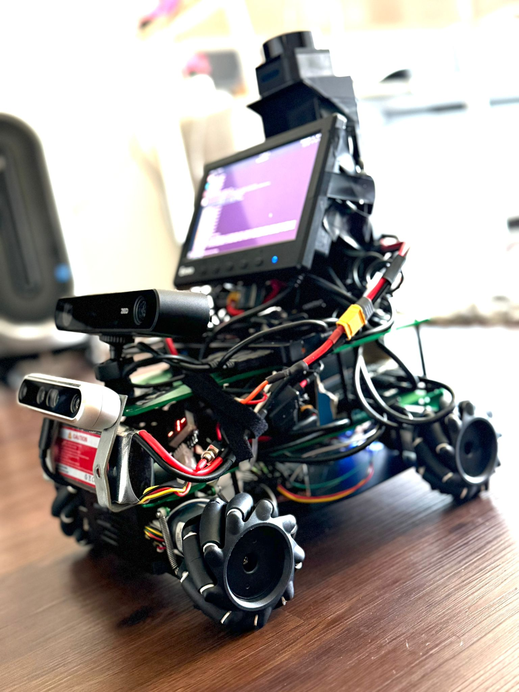
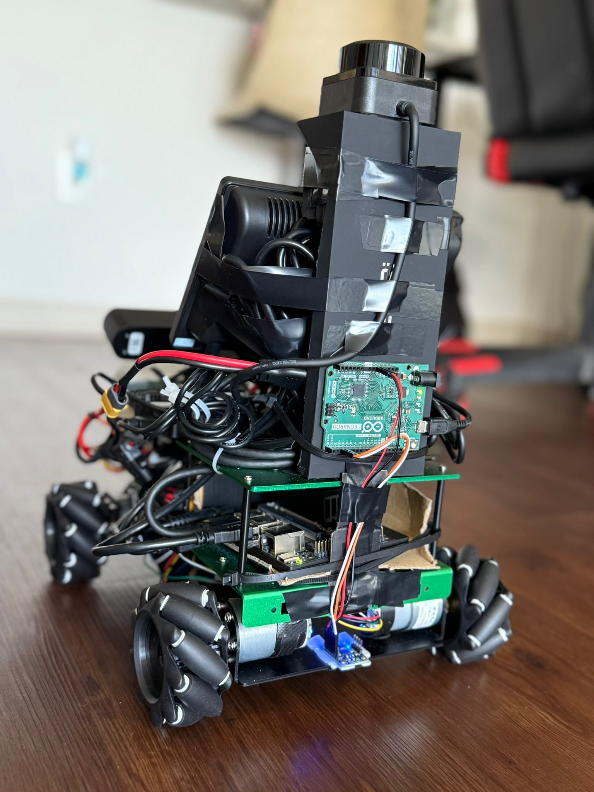
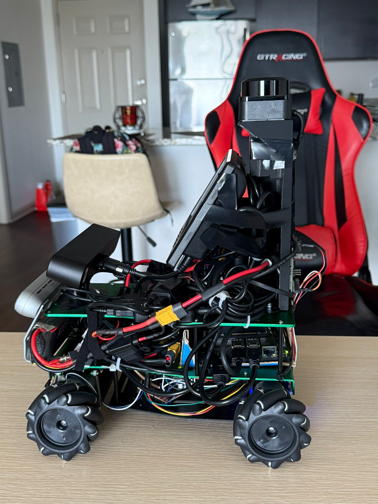

# 🤖 Luuno Robot

**Prepared by:** Jaime Rey  
**Major:** Computer / Software Engineering  
**Date:** July 30, 2025  

Luuno is a fully autonomous AI-powered robot designed and built from scratch, integrating advanced sensors, cameras, and custom software to perform complex navigation and interaction tasks without human intervention.  
This project demonstrates complete robotics system design: hardware, electronics, software, and real-world deployment.

---

## 🛠 Hardware Components

- **Jetson Orin Nano** – High-performance AI edge computer running JetPack 6.1 for computer vision and deep learning.
- **Arduino Leonardo** – Microcontroller for precise I/O and USB emulation.
- **ZED 2i Stereo Camera** – Depth mapping, SLAM, and face recognition.
- **Intel RealSense D455** – Depth sensing and gesture detection.
- **RPLIDAR S3** – 2D LiDAR for mapping and obstacle detection.
- **Adafruit BNO055** – 9-DOF orientation sensor with sensor fusion.
- **RoboClaw 2x15A** – Smart motor controller with encoder support.
- **80mm Mecanum Wheels with 12V Gear Motors** – Omni-directional movement.
- **TP-Link Powered USB Hub** – Stable USB connectivity for multiple sensors.
- **Eyoyo 7" Mini Monitor** – Compact on-board display.
- **Zeee 3S LiPo Battery (5200mAh, 11.1V)** – Main power source.

Detailed wiring diagrams, CAD models, and schematics are in [`/hardware`](hardware).

---

## 💻 Software Overview

- [Program 1 — Gesture & Face Tracking Control](code/program1_gesture_face_tracking.py)

- [Program 2 — Vision-Guided Target Tracking](code/program2_vision_target_tracking.py)

- [Program 3 — Precision Encoder & LIDAR Navigation](code/program3_precision_lidar_navigation.py)

- [Program 4 — Hybrid Escape Navigation](code/program4_hybrid_escape_navigation.py)


---

## 📄 Documentation
- Full project report in [`/docs`](docs)  
  Includes:
  - Component datasheets
  - Assembly instructions
  - Software setup
  - Test results and analysis

---

## 🖼️ Media

Photos and videos of Luuuno in action:

### 📸 Images
| Image 1 | Image 2 | Image 3 |
| ------- | ------- | ------- |
|  |  |  |


---

### 🎥 Demo Videos
- [Find Your Way Out Demo](media/find_your_way_out_demo.mp4)  
- [Follow My Commands Demo](media/follow_my_comands_demo.mp4)  
- [Follow My Other Robot Demo](media/follow_my_other_robot_demo.mp4)  
- [Maintain Your Distance Demo](media/mantain_your_distance_demo.mp4)  
- [Recognize My Face (Only Me) and Follow Me Demo](media/recognize_my_face_only_me_and_follow_me_demo.mp4)  
- [Self Parking Demo](media/self_parking_demo.mp4)  


---
## 🚀 Running the Programs

Clone the repository:
```bash
git clone https://github.com/jrey2020/Luuuno-Robot.git
cd Luuuno-Robot/code
# Program 1 – Gesture & Face Tracking
python3 program1_gesture_face_tracking.py

# Program 2 – Vision-Guided Target Tracking
python3 program2_vision_target_tracking.py

# Program 3 – Precision Encoder & LIDAR Navigation
python3 program3_precision_lidar_navigation.py

# Program 4 – Hybrid Escape Navigation
python3 program4_hybrid_escape_navigation.py


